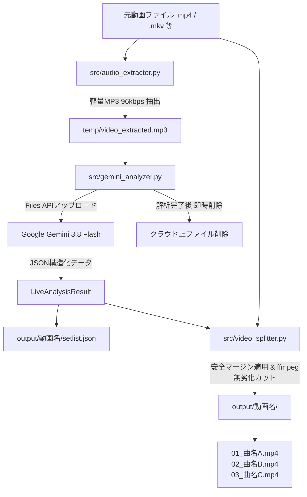

# システム設計書 & アーキテクチャ判断記録 (Architecture & ADR)

本ドキュメントでは、Live Movie Auto Cutter の内部アーキテクチャ、処理パイプライン、および主要な設計判断理由（ADR: Architectural Decision Records）をまとめます。

---

## 1. システムアーキテクチャ概要

---

## 2. 主要な設計判断理由 (ADRs)

### ADR-01: 動画ではなく「96kbps MP3」を抽出してAPIに送信する
* **背景**: ライブ動画（フルHD/4K）は数GB〜数十GBあり、直接APIへアップロードすると通信時間が膨大になり、API容量制限（通常2GB等）に抵触する。
* **決定**: ローカルのffmpegで96kbpsのMP3を一時生成し、音声のみをGeminiに送信する。
* **効果**:
  * データサイズを約99%削減（2時間のライブでも約80MB程度）。
  * アップロードが数秒〜十数秒で完了し、大幅な高速化とAPIコスト削減を達成。
  * 歌詞の聞き取り・曲間認識には96kbpsで十分な精度が保たれる。

### ADR-02: デフォルトで「無劣化ストリームコピー (`-c copy`)」を採用
* **背景**: 動画の再エンコードはCPU/GPUに負荷がかかり、2時間の動画の分割に数十分以上を要する上、画質が劣化する。
* **決定**: デフォルトではffmpegの `-c copy`（無劣化切り出し）を採用し、指定秒数通りの完全フレーム精度が必要な場合のみ `--reencode` オプションを提供する。
* **効果**:
  * 1曲あたりわずか数秒、全体でも数十秒で分割が完了。
  * 元動画の画質・音質を100%維持。

### ADR-03: 安全マージン（デフォルト前後3.5秒）の自動付与
* **背景**: LLM（AI）の認識するタイムスタンプには1〜2秒程度の誤差が生じる可能性があり、演奏の最初の音（アタック音）や最後の余韻が切れてしまうリスクがある。
* **決定**: 認識された開始時刻の「3.5秒前」、終了時刻の「3.5秒後」を自動的に切り出し範囲として計算する（0秒未満や総尺超過は自動クリップ）。ウィザードや引数で2秒〜5秒以上へ調整可能。
* **効果**: 演奏の頭切れ・余韻切れを確実に防止し、ライブの臨場感・余韻を綺麗に残す。

### ADR-04: クラウドストレージの即時削除（プライバシー保護）
* **背景**: ユーザーのライブ動画・音声データがクラウド上に残り続けることはプライバシー・著作権上望ましくない。
* **決定**: `src/gemini_analyzer.py` の `finally` 節で、Gemini Files API に登録された音声ファイルを解析終了直後に自動削除する。
* **効果**: クラウド側に個人データや音声が残留しないクリーンな運用を保証。

### ADR-05: MC切り出しモード（separate / attach / omit）の設計
* **背景**: ライブ動画では「MCだけを単体で楽しみたい」場合と、「MCから曲に入る流れを一続きで1本にしたい」場合がある。
* **決定**: 
  - `separate`: MCを単体動画として保存（`[MC]_タイトル.mp4`）
  - `attach`: 直前のMCを曲の冒頭に結合して1本の動画として保存（`[MC+Song]_曲名.mp4`）
  - `omit`: 楽曲のみを切り出し
* **効果**: ユーザーの鑑賞スタイルやYouTube投稿スタイルに応じた柔軟なアーカイブが可能。

### ADR-06: 歌詞SRT字幕とYouTube投稿情報の自動出力
* **背景**: 切り出した動画をYouTubeに投稿する際、タイトル・概要欄・曲紹介・歌詞を手動で作成・入力するのは大きな手間となる。
* **決定**: Gemini解析時に歌詞や曲の雰囲気、おすすめタグ、概要欄用テキストを同時に生成させ、動画ファイルごとに同名の `.srt`（字幕）と `_youtube_info.txt` を自動書き出しする。
* **効果**: 動画プレーヤーでの字幕表示に対応し、YouTube投稿時はテキストをコピペするだけで一瞬でリッチな動画投稿が完了する。
